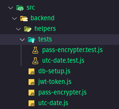

# 🔑 Keys

**Seu Gerenciador de Senhas *Open-Source* confiável para uso pessoal! 🔒**

- Organização pessoal
- Interface Intuitiva
- Geração de Senhas Seguras
- Feedback de Segurança das suas Senhas
- Integração com o seu Navegador

E muito mais!

## 📌 Sumário

- [Sobre o Projeto](#sobre-o-projeto)
    - [Como surgiu o projeto?](#como-surgiu-o-projeto)
    - [Tecnologias](#tecnologias)
- [Como rodar o projeto?](#como-rodar-o-projeto)
- [Como contribuir com o projeto](#como-contribuir-com-o-projeto)
    - [Organização Geral](#organização-geral)
    - [Estrutura de Pastas](#estrutura-de-pastas)
    - [Branches](#branches)
    - [Tarefas pendentes](#tarefas-pendentes)

## 📖 Sobre o Projeto

Este projeto é um **aplicativo desktop** para gerenciamento de senhas, oferecendo uma maneira **segura** e **prática** de armazenar, gerar e organizar suas credenciais.

Com uma **interface simples e intuitiva**, o aplicativo permite que o usuário:

- Armazene todas as suas senhas em um único local seguro;
- Acesse o sistema com uma senha mestre (***master password***);
- **Gere senhas fortes e seguras automaticamente**;
- Receba feedback sobre a força das senhas utilizadas;
- Complete senhas automaticamente no navegador (***autofill***).

---

### 🚀 Como surgiu o projeto?

**A ideia surgiu da minha própria necessidade**: por questões de segurança digital, costumo trocar minhas senhas com frequência e criar combinações cada vez mais fortes. Com isso, lembrar de todas elas nem sempre é tão simples, **sempre acabo me esquecendo de alguma**.

**Anotar senhas em blocos de notas ou arquivos soltos não é uma prática segura**. Por isso, decidi desenvolver um gerenciador de senhas para uso pessoal — um software **confiável** que eu mesmo usaria no dia a dia.

Com a evolução da tecnologia no mundo inteiro, **ficou cada vez mais comum que uma pessoa tenha múltiplas contas com senhas em diferentes sites pela web**.

A proposta inicial era simples: **"Vou criar uma ferramenta funcional e segura, que qualquer pessoa pudesse baixar pelo GitHub e executar localmente"**, sem complicações.

---

### 🛠️ Tecnologias

***Front-End:***

O projeto também utiliza a biblioteca ***Mustache*** para inserir variáveis de ambiente `.env` não-sensíveis no ***front-end***, através de um campo `<input type="hidden">`.

Essa abordagem permite **compartilhar de forma segura** alguns dados definidos no arquivo `.env` com o ***front-end*** — como nomes de usuário genéricos, mensagens padrão ou configurações visíveis ao cliente — **sem expor informações sensíveis, como senhas ou chaves de API**.

---

***Back-End:***

---
**Outros:**

O projeto também utilizará ***WebExtensions*** (extensões para navegadores compatíveis, como *Chrome* e *Firefox*) para permitir a **integração entre o aplicativo desktop e o navegador do usuário**.

**Essa funcionalidade será totalmente opcional** e permitirá, por exemplo, o **preenchimento automático de senhas** diretamente em sites acessados pelo navegador, melhorando a praticidade no uso diário.

## ⚙️ Como rodar o projeto?

Em seguida um passo-a-passo de como rodar o projeto na sua máquina:

- [Windows](docs/run-windows.md)
- [Linux](docs/run-linux.md)

Em breve, o projeto terá uma área de *Downloads* onde vão ficar os arquivos já compilados.

## 🤝 Como contribuir com o projeto

Se você é desenvolvedor e quer colaborar, sinta-se à vontade para abrir um ***Pull Request*** com suas melhorias. Todas as contribuições serão avaliadas com atenção por mim.

Aceitamos contribuições de diversos tipos, como:
- Melhorias na documentação **(*README*, *JSDoc*, etc.)**
- Implementação de arquivos de teste
- Implementação de novas funcionalidades
- Refatoração de código existente
- Correções de bugs
- Melhorias na interface

Toda ajuda é bem-vinda — mesmo pequenas melhorias fazem diferença!

Caso não tenha nenhuma ideia de contribuição em mente, você ainda pode dar uma olhada na nossa [Lista de Tarefas Pendentes](docs/tasks.md).

---

### 🛸 Organização Geral

Essa seção apresenta as principais convenções, regras e diretrizes que seguimos no projeto.

Antes de contribuir, é bom observar que **seguimos as convenções padrão do *JavaScript*/*TypeScript***. Caso surjam dúvidas, consulte arquivos já existentes para entender o estilo e a organização do código. A ideia é **manter consistência na base do projeto**.

Não sou rígido com detalhes como **aspas simples vs. duplas** ou **ponto-e-vírgula obrigatório**, mas padronizações como:
- Nome de variáveis em `camelCase`
- Classes em `PascalCase`
- Funções com nomes descritivos
- *Types* começam com **"`T`"** e *Interfaces* começam com **"`I`"**
- *Commits*, nomes de arquivos, variáveis, funções, classes e afins todas em **Inglês**. 

...são importantes para manter o projeto bem estruturado.

A seguir, os principais pontos da organização geral:

---

#### 📚 Documentação

A documentação geral está escrita em ***Markdown*** e organizada na pasta `/docs`. Lá você encontrará informações sobre o projeto, como contribuir, tarefas pendentes e mais.

A documentação dos arquivos `.js` e `.ts` segue o padrão oficial do [JSDoc](https://jsdoc.app/), tanto no *back-end* quanto no *front-end*.

---

#### 🧪 Testes Automatizados

É bem comum que muitos arquivos fiquem sem testes escritos quando são criados pela primeira vez. Por isso **boa parte do projeto sempre acaba ficando sem testes** por falta de tempo.

Caso você sinta interesse em contribuir com os testes, saiba que seguimos algumas **regras** para os testes.

A estrutura dos arquivos de teste segue esta lógica:
- Para cada diretório com *scripts*, deve haver uma subpasta `/test` contendo os testes correspondentes.

- Cada arquivo de *script* (exceto os da raiz do *back*/*front* e da pasta `/view`) deve ter **um arquivo de teste correspondente.**

- Em especial, todos os **utils/helpers, middlewares, controllers e models** devem ser testados.

**Objetivo**: manter testes unitários consistentes e atualizados.

---

#### ✨ Features

Sinta-se à vontade para:
- Implementar mais funcionalidades
- Sugerir ideias em seus ***Pull Requests***
- Ajudar no desenvolvimento de funcionalidades listadas nas [tarefas pendentes](docs/tasks.md)

---

#### ♻️ Refatorações

Você pode propor melhorias no código já existente. Também há sugestões específicas de refatoração na [lista de tarefas](docs/tasks.md).

---

#### 🐞 Correções de Bugs

Quer ajudar corrigindo bugs? Você pode:
- Investigar e corrigir *bugs* que encontrar
- Verificar se já existem *bugs* listados na [lista de tarefas](docs/tasks.md).

---

#### 🎨 Interface

A *branch* de interface está sempre aberta para sugestões de redesign ou ajustes visuais.
Caso queira propor mudanças no layout, inclua **uma imagem de exemplo** no seu *pull request* — pode ser um *print*, *mockup* ou layout *Figma*.

---

### 📁 Estrutura de Pastas

Confira aqui a [Estrutura de Pastas](docs/structure.md) do projeto!

---

### 🌿 Branches

`main`: Branch principal do projeto.
- ↳ `front/main`: Branch principal do *front-end*, use ela apenas como ponte para *merges*.
    - ↳ `front/interface`: **Construção de interfaces** no *front-end*.
    - ↳ `front/features`: **Features** do *front-end*.
    - ↳ `front/fix-bugs`: **Correção de bugs** do *front-end*.
    - ↳ `front/refactor`: **Refatoração** de *front-end*.
    - ↳ `front/docs`: **Documentação** do *front-end*.
- ↳ `back/main`: Branch principal do *back-end*, use ela apenas como ponte para *merges*.
    - ↳ `back/database`: **Modelagem do Banco de Dados**
    - ↳ `back/features`: **Features** do *back-end*.
    - ↳ `back/fix-bugs`: **Correção de bugs** do *back-end*.
    - ↳ `back/refactor`: **Refatoração** de *back-end*.
    - ↳ `back/docs`: **Documentação** do *back-end*.
`docs`: Branch para documentação geral do projeto na pasta `/docs`.

---

### 📌 Tarefas pendentes

[Lista de Tarefas Pendentes](docs/tasks.md)
