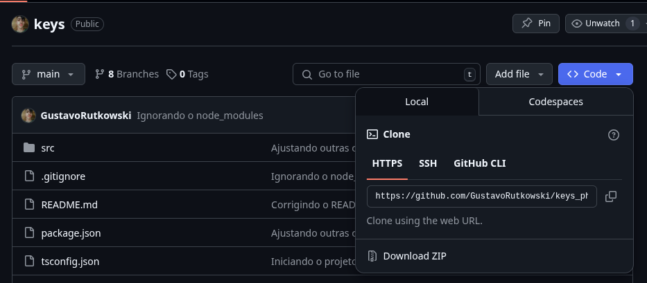

# Como rodar o projeto? (LINUX)

> **Obs.:** Esses comandos são os padrões da maioria das distros Linux baseadas em Ubuntu.

<h2 align="center">Pré-Requisitos</h2>

Para que o software possa ser compilado e executado corretamente na sua máquina, **é necessario que você tenha instalado no seu computador alguns pré-requisitos**:

1. [MySQL Server](https://dev.mysql.com/downloads/installer/)

```bash
sudo apt update
sudo apt install mysql-server
```

2. [Node.js + NPM](https://nodejs.org/pt/download)

```bash
sudo apt update
sudo apt install nodejs npm
```


Caso você ainda não os tenha instalado, instale-os antes de prosseguir!


<h2 align="center">Passo-a-passo</h2>

1. Abra o seu *MySQL* no terminal para criar o banco:

```bash
sudo mysql -u root -p
```

Após isso, insira sua senha e execute o comando abaixo:

```sql
CREATE DATABASE IF NOT EXISTS keys;
```

---

2. No navegador, abra a página do *Github* do projeto, clique em `"Download ZIP"` para baixar o arquivo.



---

3. Após baixar o arquivo `.zip`, vá até a pasta onde ele foi salvo e extraia-o:

```bash
cd ~/Downloads # ou a pasta onde o ZIP foi baixado
unzip keys.zip
cd keys
```

4. Crie uma cópia de `.env.example` chamada `.env`.

```bash
cd src
cp .env.example .env
```

5. Abra o arquivo `.env` (seja usando `nano` ou algum editor de texto).

```bash
nano .env
```

---


Altere a linha `MYSQL_PASSWORD` para sua própria senha do *MySQL*.

**(Opcional)** Altere a linha `JWT_SECRET` para uma palavra-secreta de sua preferência.

---

6. Execute o seguinte comando no terminal:

```bash
cd .. # Garanta que você esteja na pasta /keys
npm install
npm run start
```

E espere ele se encerrar.

7. Abra o projeto no seu navegador pela URL `http://localhost:2030/login`.