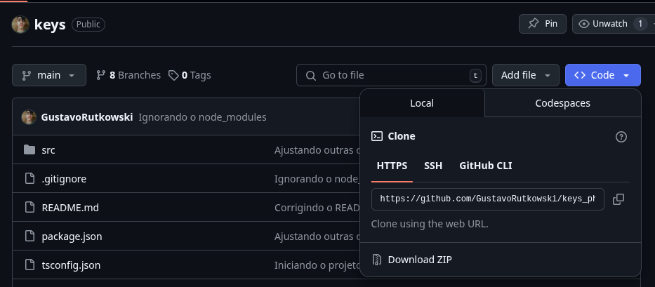
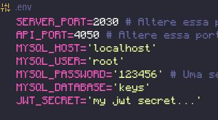

# Como rodar o projeto? (WINDOWS)

<h2 align="center">Pré-Requisitos</h2>

Para que o software possa ser compilado e executado corretamente na sua máquina, **é necessario que você tenha instalado no seu computador alguns pré-requisitos**:

1. [MySQL Installer](https://dev.mysql.com/downloads/installer/)

> **Obs.:** Para cumprir os pré-requisitos você precisa, minimamente, ter o ***MySQL Server*** e o ***MySQL Workbench*** instalados.

2. [Node.js + NPM](https://nodejs.org/pt/download)


Caso você ainda não os tenha instalado, instale-os antes de prosseguir!

---

<h2 align="center">Passo-a-passo</h2>

1. Abra o seu *MySQL Workbench* e rode o comando: `CREATE DATABASE IF NOT EXISTS keys;`

2. No navegador, abra a página do *Github* do projeto, clique em `"Download ZIP"` para baixar o arquivo.



---

3. Após baixar o arquivo `.zip`, vá até a pasta onde ele foi salvo e extraia-o.

Após isso, navegue até `/keys/src/`.

4. Crie uma cópia do arquivo `.env.example` chamada `.env`.

5. Abra o arquivo `.env` com um bloco de notas ou qualquer outro editor de texto;





Altere a linha `MYSQL_PASSWORD` para sua própria senha do *MySQL*.

**(Opcional)** Altere a linha `JWT_SECRET` para uma palavra-secreta de sua preferência.

---

6. Volte para a pasta `/keys` e abra-a com o **Prompt de Comando**.

> **Obs.:** Clique com **botão direito** sobre a pasta, depois vá em **`"Abrir com..."`** e selecione o **Prompt de Comando**.

7. Execute o seguinte comando no terminal:

```bash
npm install
npm run start
```

E espere ele se encerrar.

8. Abra o projeto no seu navegador pela URL `http://localhost:2030/login`.